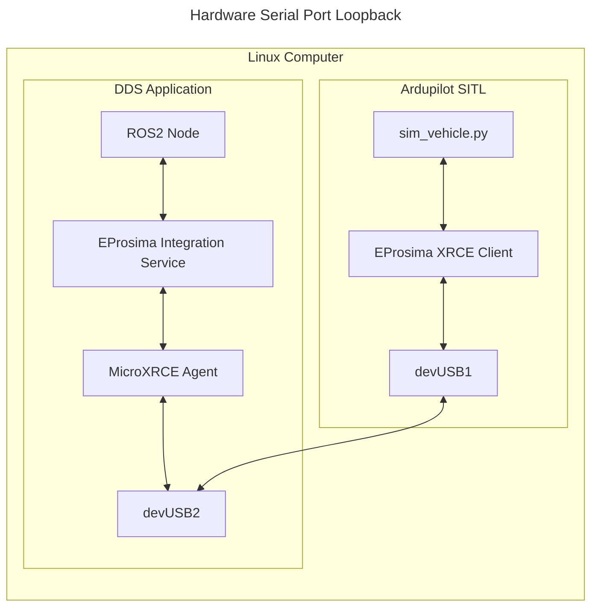

# Testing with DDS/micro-Ros

## Architecture

Ardupilot contains the XRCE Client library, which can run as SITL. Then, the DDS application runs a ROS2 node, an EProsima Integration Service, and the MicroXRCE Agent. The two systems communicate over serial, which is the only supported protocol in Ardupilot MicroXCE DDS at this time.



## Testing with a UART

On Linux, first create a virtual serial port for use with SITL like [this](https://stackoverflow.com/questions/52187/virtual-serial-port-for-linux)

```
sudo apt-get update
sudo apt-get install socat
```

Then, start a virtual serial port with socat. Take note of the two `/dev/pts/*` ports. If yours are different, substitute as needed.
```
socat -d -d pty,raw,echo=0 pty,raw,echo=0
>>> 2023/02/21 05:26:06 socat[334] N PTY is /dev/pts/1
>>> 2023/02/21 05:26:06 socat[334] N PTY is /dev/pts/2
>>> 2023/02/21 05:26:06 socat[334] N starting data transfer loop with FDs [5,5] and [7,7]
``` 

Set up your [SITL](https://ardupilot.org/dev/docs/setting-up-sitl-on-linux.html). 
Run the simulator with the following command (assuming we are using tty/pts/1 for Ardupilot SITL):
```
# Select your favorite vehicle type
cd ArduCopter
# Wipe params till you see "AP: ArduPilot Ready"
sim_vehicle.py -w
# Set params
param set SERIAL1_BAUD 115

# See libraries/AP_SerialManager/AP_SerialManager.h AP_SerialManager SerialProtocol_ROS2
param set SERIAL1_PROTOCOL 45
```

# Start the sim
```
sim_vehicle.py -D  --console --enable-xrce-dds -A "--uartC=uart:/dev/tty/pts/1"
```

Then set the following parameters :

- set **SERIAL1_BAUD = 115**
- set **SERIAL1_PROTOCOL = 44**

Now set the XRCE parameters:

- set **XRCE_TYPE = 0** (default) for a DDS Agent
- set **XRCE_TYPE = 1** for a micro-ROS Agent

- set **XRCE_TOPIC**( based on the topic you want Ardupilot to publish)

## Starting DDS Agent

Follow the steps to use the DDS agent

- Install DDS Agent (as described here), using the stable `master` branch

  - https://micro-xrce-dds.docs.eprosima.com/en/latest/installation.html#installing-the-agent-standalone

- In a new terminal, run the following command :

  - ```cd /usr/local/bin && MicroXRCEAgent serial -b 115200 -D /dev/ttyUSB2``` (assuming we are using ttyUSB2 for Ardupilot)
or,
  - ```cd /usr/local/bin && MicroXRCEAgent tcp4 -p 2019``` (assuming we are using the port 2019)

For more information ,one can take a look here - https://micro-xrce-dds.docs.eprosima.com/en/latest/agent.html#agent-cli

## Starting with microROS Agent

Follow the steps to use the microROS Agent

- Install ROS Humble (as described here)

  - https://docs.ros.org/en/humble/Installation/Ubuntu-Install-Debians.html

- Install and run the microROS agent (as descibed here). Make sure to use the `humble` branch.

  - https://micro.ros.org/docs/tutorials/core/first_application_linux/

- Run microROS agent with the following command

  - ```ros2 run micro_ros_agent micro_ros_agent serial -b 115200 -D /dev/ttyUSB2 (assuming we are using ttyUSB2 for Ardupilot)```

## Tutorial

### Setting the ROS2-workspace

If you have installed the microROS agent and ROS-2 Humble

- Source the ros2 installation
  - ```source /opt/ros/humble/setup.bash```

- Create a ros2 workspace

  - ```mkdir -p ~/dev_ws/src```

- You can install a simple ros2 package from here : https://github.com/arshPratap/ROS2-test-example.git

- ```cd ~/dev_ws/src```
- clone the above repo
- Build the package
  - In the root of dev_ws, run:
   ```colcon build --packages-select AP_Ros2_Int```

### Run the microROS agent

- Run the microROS agent as described above

- ros2 run micro_ros_agent micro_ros_agent serial -b 115200 -D /dev/ttyUSBX (replace X with the correct port number)

### Run the Ardupilot simulator

- As described above , run the Ardupilot simulator and make sure the following parameters have the corresponding values

  - **SERIAL1_BAUD 115**
  - **SERIAL1_PROTOCOL 41**
  - **XRCE_TYPE  1**
  - **XRCE_TOPIC 7**

- Once the above values are set ,run the simulator again as :

  - ```sim_vehicle.py --enable-xrce-dds -A "--uartC=uart:/dev/ttyUSB2:115200" --console```

If everything has been setup correctly , you will see the session established message on the agent.

### Reading ROS2 data

- Open a new terminal
- Source ROS2 installation
  - ```source /opt/ros/humble/setup.bash```
- Go to the ROS2 workspace created earlier
- Source the package installation (make sure you are in the root of the dev_ws folder)
  - ```source install/setup.bash```

- Then run the following commands
  - ```ros2 node list```
    - you should see the following name in the node list(if everything is setup correctly)
    - */Ardupilot_XRCE_Client*

  - ```ros2 topic list```
    - you should see the following name in the topic list(if everything is setup correctly)
    - /AP_ROS2_Int8

  - ```ros2 run AP_Ros2_Int listener```

    - you should see the ROS2 subscriber listening to the 8bit Int being sent from Ardupilot
